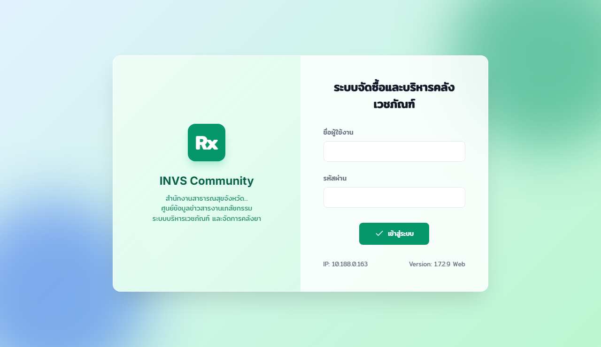

# RX.INVs Project

 **[Live Demo on GitHub Pages](https://natthanon41.github.io/RX.INVs/)**  
*(Features a Demo Mode with Mock Data when the backend is unavailable)*

This project consists of a backend server and a web-based frontend for the INVs system.

## Screenshots

<b>Click to expand/collapse screenshots</b>

### Dashboard

### Inventory Management

### Purchase Orders

### Dispense

### Requisition

## Project Structure

- `invs-backend/`: Node.js backend server.
- `invs-web/`: Frontend web application (React/Vite).
- `report_files/`: Templates and configurations for reports.

## Getting Started

### Prerequisites

- Node.js installed.
- MySQL Database (MySQL 8.0+ recommended).

### Setup

1. **Backend**:
    - Navigate to `invs-backend/`.
    - Install dependencies: `npm install`.
    - Configure `.env` with your database credentials.
    - Start the server: `npm start`.

2. **Web (Frontend)**:
    - Navigate to `invs-web/`.
    - Install dependencies: `npm install`.
    - Start the development server: `npm run dev`.

## Note on Large Files

Large database dumps (`.sql`) and executables (`.exe`) are excluded from this repository for performance and security. Please ensure you have your local database initialized before running.
